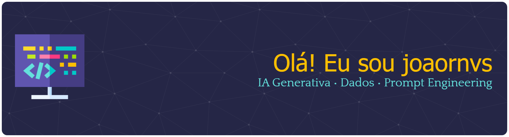

  

# 👋 Olá, eu sou joaornvs

💻 Estudando Inteligência Artificial e Dados  
🤖 Focado em IA Generativa, Prompt Engineering e projetos práticos  
📊 Explorando análise de dados e aplicações de IA no mundo real  

📌 Projeto atual: **Real Life Finance Atlas**

---

# 🚀 Sobre mim

Sou um estudante de tecnologia focado em Inteligência Artificial e Dados.  
Atualmente participo de bootcamps e desenvolvo projetos práticos para construir experiência real na área de IA.

Meu objetivo é trabalhar com:

- Inteligência Artificial
- Análise de Dados
- Sistemas inteligentes
- Automação com IA

---

# 🧠 Tecnologias e ferramentas

---

# 📊 Estatísticas do GitHub

---

# 🔥 Streak de Contribuições

---

# 🌎 Projetos em destaque

📌 **Real Life Finance Atlas**  
Guia de educação financeira usando IA e NotebookLM.

---

⭐ Sempre aprendendo e construindo novos projetos em IA.
